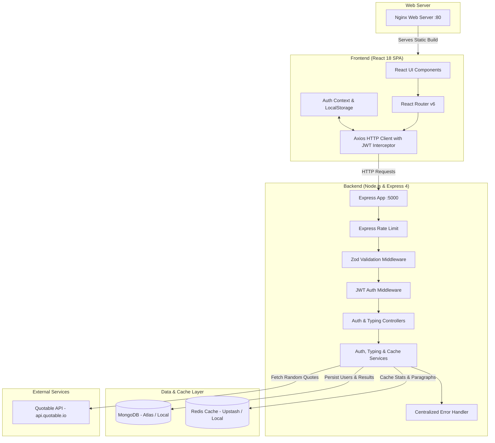
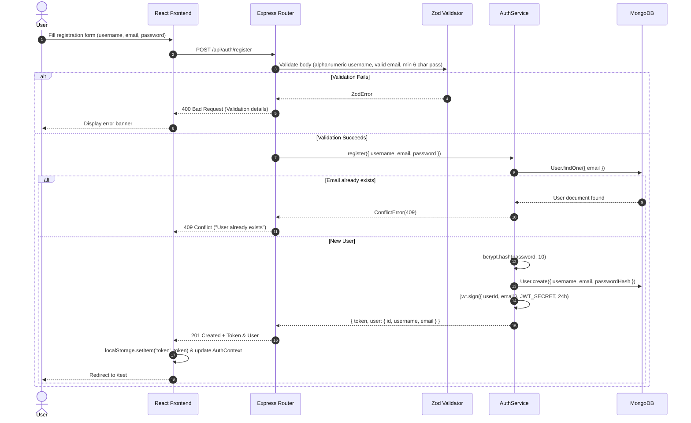
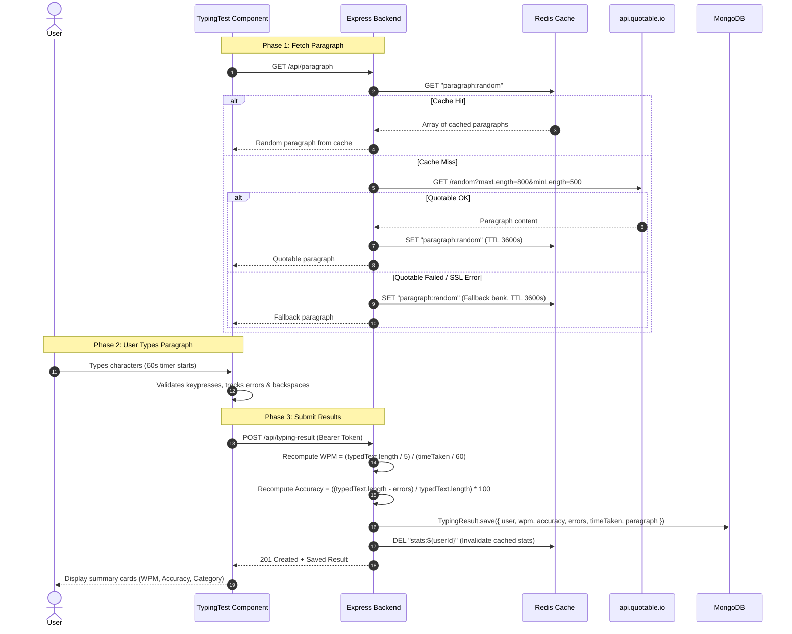
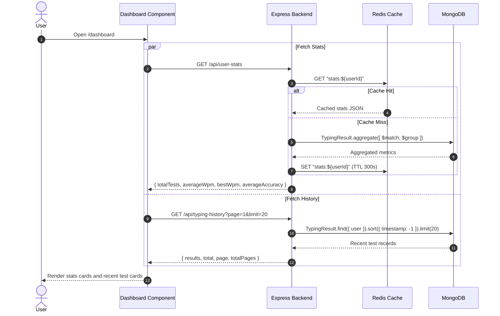

# ⚡ TypeBolt — Comprehensive Project Documentation & Architecture Guide

> **Author / Reference Guide for Developers**  
> **Repository:** `typebolt`  
> **Last Updated:** September 2026  
> **Purpose:** Detailed deep-dive into the entire architecture, backend, frontend, database schemas, caching, tests, deployment pipeline, known gotchas, and actionable roadmap for future enhancements.

---

## 📑 Table of Contents

1. [Executive Summary](#1-executive-summary)
2. [High-Level Architecture & Tech Stack](#2-high-level-architecture--tech-stack)
3. [Project Directory & File Structure](#3-project-directory--file-structure)
4. [Backend Deep Dive](#4-backend-deep-dive)
   - [4.1 Server Entry Point (`server.js`)](#41-server-entry-point-serverjs)
   - [4.2 Configuration Layer (`config/`)](#42-configuration-layer-config)
   - [4.3 Database Models & Schemas (`models/`)](#43-database-models--schemas-models)
   - [4.4 Middleware Pipeline (`middlewares/`)](#44-middleware-pipeline-middlewares)
   - [4.5 Request Validation (`validators/`)](#45-request-validation-validators)
   - [4.6 Controllers & Services (`controllers/` & `services/`)](#46-controllers--services-controllers--services)
   - [4.7 Error Handling Architecture (`utils/customErrors.js`)](#47-error-handling-architecture-utilscustomerrorsjs)
   - [4.8 Redis Caching Strategy (`services/cacheService.js`)](#48-redis-caching-strategy-servicescacheservicejs)
   - [4.9 Automated Testing Suite (`tests/`)](#49-automated-testing-suite-tests)
5. [Frontend Deep Dive](#5-frontend-deep-dive)
   - [5.1 App Architecture & Routing (`App.js`)](#51-app-architecture--routing-appjs)
   - [5.2 Authentication State Management (`context/AuthContext.jsx`)](#52-authentication-state-management-contextauthcontextjsx)
   - [5.3 API Client & Interceptors (`utils/api.js`)](#53-api-client--interceptors-utilsapijs)
   - [5.4 Typing Engine & Algorithm (`pages/TypingTest.js` & `utils/typingUtils.js`)](#54-typing-engine--algorithm-pagestypingtestjs--utilstypingutilsjs)
   - [5.5 Dashboard & Analytics (`pages/Dashboard.js`)](#55-dashboard--analytics-pagesdashboardjs)
   - [5.6 Design System & Styling (`App.css`, `TypingTest.css`, etc.)](#56-design-system--styling-appcss-typingtestcss-etc)
6. [End-to-End Execution Flows](#6-end-to-end-execution-flows)
   - [6.1 User Registration & Login Flow](#61-user-registration--login-flow)
   - [6.2 Typing Test & Server Recomputation Flow](#62-typing-test--server-recomputation-flow)
   - [6.3 Dashboard Aggregation & Cache Invalidation Flow](#63-dashboard-aggregation--cache-invalidation-flow)
7. [DevOps, CI/CD, and Docker](#7-devops-cicd-and-docker)
   - [7.1 Docker Compose Environment](#71-docker-compose-environment)
   - [7.2 Dockerfiles (Multi-Stage Frontend & Alpine Backend)](#72-dockerfiles-multi-stage-frontend--alpine-backend)
   - [7.3 GitHub Actions CI Workflow](#73-github-actions-ci-workflow)
8. [Current Gotchas, Bugs & Observations](#8-current-gotchas-bugs--observations)
9. [Actionable Roadmap & Future Improvements](#9-actionable-roadmap--future-improvements)

---

## 1. Executive Summary

**TypeBolt** is a production-ready, full-stack speed typing test and analytics web application. It is designed to evaluate a user's typing speed (Words Per Minute — WPM), accuracy percentage, error count, and progress over time.

Key application highlights:
- **Real-time typing test engine:** 60-second typing sessions with character-by-character validation, error backspacing, and instant visual feedback.
- **Server-side verification (Anti-Cheat):** Results submitted by the client are recomputed independently on the server using standardized formulas before being stored in the database.
- **High-performance caching:** Paragraphs and user statistical aggregates are cached in **Redis** with strategic Time-to-Live (TTL) policies and event-driven cache invalidation.
- **Resilient Fallback Design:** Fallback paragraph banks ensure the typing test functions seamlessly even if external quote APIs experience SSL or network failures.
- **Modern Security:** JWT authentication, bcrypt password hashing, rate limiting on sensitive routes, and Zod runtime schema validation.
- **Cloud-Ready Deployment:** Dockerized multi-container setup managed via Docker Compose, backed by Nginx for SPA routing and automated by GitHub Actions CI.

---

## 2. High-Level Architecture & Tech Stack



### Core Technologies:
| Layer | Technologies | Key Packages |
|---|---|---|
| **Frontend** | React 18, HTML5, CSS3 | `react-router-dom` v6, `axios` v1.5, `react-scripts` v5 |
| **Backend** | Node.js, Express.js | `express` v4.18, `zod` v4, `jsonwebtoken` v9, `bcryptjs` v2.4, `cors` |
| **Database** | MongoDB | `mongoose` v7.5 |
| **Caching** | Redis (Upstash / Alpine) | `redis` v6.0 |
| **Security** | Rate Limiting & Validation | `express-rate-limit` v8, `zod` |
| **Testing** | Jest, Supertest | `jest` v30, `supertest` v7, `mongodb-memory-server` v11 |
| **DevOps** | Docker, Nginx, GitHub Actions | `docker-compose`, `nginx:alpine`, `node:20-alpine` |

---

## 3. Project Directory & File Structure

```text
typebolt/
├── .github/
│   └── workflows/
│       └── ci.yml              # GitHub Actions Continuous Integration pipeline
├── backend/
│   ├── config/
│   │   ├── db.js               # MongoDB Mongoose connection setup
│   │   ├── redis.js            # Redis client creation & auto-reconnect logic
│   │   └── validateEnv.js      # Zod validation schema for environment variables
│   ├── controllers/
│   │   ├── authController.js   # Request handlers for /register and /login
│   │   └── typingController.js # Handlers for /paragraph, /typing-result, /history, /stats
│   ├── middlewares/
│   │   ├── auth.js             # JWT bearer verification middleware
│   │   ├── errorHandler.js     # Centralized error handler with standardized JSON payload
│   │   └── rateLimiter.js      # Rate limiters for auth endpoints
│   ├── models/
│   │   ├── TypingResult.js     # Mongoose schema for tests, compound index on (user, timestamp)
│   │   └── User.js             # Mongoose schema for registered users
│   ├── routes/
│   │   ├── auth.js             # Express routes for authentication
│   │   └── typing.js           # Express routes for typing tests & statistics
│   ├── services/
│   │   ├── authService.js      # Business logic: registration, password hashing, JWT creation
│   │   ├── cacheService.js     # Redis wrapper: get, set, del with graceful fallback
│   │   └── typingService.js    # Business logic: recomputing WPM/accuracy, aggregation, caching
│   ├── tests/
│   │   ├── setup.js            # Jest setup with MongoMemoryServer in-memory DB lifecycle
│   │   ├── auth.test.js        # 9 unit/integration tests for auth flows
│   │   ├── typing.test.js      # 8 unit/integration tests for typing & aggregation flows
│   │   └── utils.test.js       # Unit tests for accuracy calculation utility
│   ├── utils/
│   │   ├── accuracy.js         # Accuracy calculation logic: ((typed - errors) / typed) * 100
│   │   └── customErrors.js     # Custom AppError classes (Validation, NotFound, Unauthorized, Conflict)
│   ├── validators/
│   │   └── authValidators.js   # Zod request body schemas for registration and login
│   ├── Dockerfile              # Docker container configuration for backend service
│   ├── eslint.config.js        # Modern Flat ESLint config
│   ├── package.json            # Backend scripts & dependencies
│   ├── README.md               # Backend specific documentation
│   └── server.js               # Main Express application entry point & health check
├── frontend/
│   ├── public/
│   │   └── index.html          # HTML shell, Google Fonts (JetBrains Mono)
│   ├── src/
│   │   ├── components/
│   │   │   ├── Navbar.css      # Top navigation styles
│   │   │   └── Navbar.js       # App header with active user status and logout
│   │   ├── context/
│   │   │   └── AuthContext.jsx # React Context for global auth state (user, token, login, logout)
│   │   ├── pages/
│   │   │   ├── Dashboard.css   # Stats cards, history list styles
│   │   │   ├── Dashboard.js    # User metrics & recent test history viewer
│   │   │   ├── Login.css       # Login form styles
│   │   │   ├── Login.js        # Login page
│   │   │   ├── Register.css    # Register form styles
│   │   │   ├── Register.js     # User registration with client validation
│   │   │   ├── TypingTest.css  # Typing interactive area, character highlighting, timer
│   │   │   └── TypingTest.js   # Core typing game engine with keydown listener
│   │   ├── utils/
│   │   │   ├── api.js          # Axios client with Authorization header interceptor
│   │   │   └── typingUtils.js  # Client helpers: WPM, accuracy, time format, speed categories
│   │   ├── App.css             # Global dark theme styles, buttons, inputs
│   │   ├── App.js              # React Router setup and route guards
│   │   └── index.js            # React 18 DOM mount point
│   ├── Dockerfile              # Multi-stage build (Node 20 build -> Nginx Alpine)
│   ├── nginx.conf              # Nginx server configuration with SPA routing support
│   └── package.json            # Frontend scripts & dependencies
├── docker-compose.yml          # Multi-container orchestration (MongoDB, Redis, Backend, Frontend)
├── README.md                   # Root project README
└── PROJECT_DOCUMENTATION.md    # This master documentation guide
```

---

## 4. Backend Deep Dive

### 4.1 Server Entry Point (`server.js`)

`backend/server.js` initializes the Express application and wires together middlewares, routes, health endpoints, and the error handler.

- **Middlewares:**
  - `cors()`: Allows cross-origin requests from the React frontend.
  - `express.json()`: Parses incoming JSON request bodies.
- **Route Mounting:**
  - `/api/auth` $\rightarrow$ `backend/routes/auth.js`
  - `/api` $\rightarrow$ `backend/routes/typing.js`
- **Health Check (`/health` and `/api/health`):**
  Inspects real-time statuses of both dependencies:
  ```javascript
  const dbStatus = mongoose.connection.readyState === 1 ? 'connected' : 'disconnected';
  const redisStatus = redisClient.isReady ? 'connected' : 'disconnected';
  const status = (dbStatus === 'connected' && redisStatus === 'connected') ? 'ok' : 'degraded';
  ```
  Returns `{ status, services: { db, redis } }`.
- **Conditional Startup:**
  `if (require.main === module)` ensures that `validateEnv()`, `connectDB()`, and `redisClient.connect()` only run when executing the file directly with `node server.js`, allowing Jest integration tests to import `app` without port conflicts or unwanted side-effects.

---

### 4.2 Configuration Layer (`config/`)

#### Environment Validation (`validateEnv.js`)
Uses **Zod** to validate critical environment variables on startup:
- `MONGO_URI`: Required string.
- `JWT_SECRET`: Required string with a **minimum length of 32 characters** (enforces strong cryptographic signatures).
- `PORT`: Optional string, defaults to `'5000'`.
- `NODE_ENV`: Optional enum (`development`, `production`, `test`), defaults to `'development'`.

If validation fails, the process logs descriptive error issues and immediately exits with status code `1`.

#### Redis Client (`redis.js`)
Initializes the Node Redis client:
- Accepts `process.env.REDIS_URL` or defaults to `redis://localhost:6379`.
- Implements an exponential backoff reconnect strategy:
  ```javascript
  reconnectStrategy: (retries) => {
    const delay = Math.min(retries * 100, 3000);
    return delay;
  }
  ```
- Listens to lifecycle events: `connect`, `ready`, `error`, and `end`.

#### Database Connection (`db.js`)
Establishes connection to MongoDB via Mongoose using `process.env.MONGO_URI` with fallback to `mongodb://localhost:27017/typebolt`. Catches connection errors and triggers `process.exit(1)`.

---

### 4.3 Database Models & Schemas (`models/`)

#### User Model (`User.js`)
| Field | Type | Attributes | Description |
|---|---|---|---|
| `username` | String | Required, Unique | The public display name (3-20 alphanumeric chars) |
| `email` | String | Required, Unique | User email address for authentication |
| `password` | String | Required | Bcrypt salted hash of the user password |
| `createdAt` | Date | Default: `Date.now` | User account creation timestamp |

#### TypingResult Model (`TypingResult.js`)
| Field | Type | Attributes | Description |
|---|---|---|---|
| `user` | ObjectId | Ref: `'User'`, Required | Reference to the authoring User |
| `wpm` | Number | Required | Words Per Minute computed server-side |
| `accuracy` | Number | Required | Accuracy percentage (0–100) computed server-side |
| `errors` | Number | Required | Total character mismatches during test |
| `timeTaken` | Number | Required | Test duration in seconds (e.g. 60) |
| `paragraph` | String | Required | Target text string assigned for the test |
| `timestamp` | Date | Default: `Date.now` | Test submission timestamp |

> **Indexing Optimization:**  
> `typingResultSchema.index({ user: 1, timestamp: -1 });`  
> This compound index allows MongoDB to instantly serve user history queries sorted by newest tests without scanning unrelated documents or sorting in memory.

---

### 4.4 Middleware Pipeline (`middlewares/`)

1. **Authentication (`auth.js`):**
   - Extracts the `Authorization` header (`Bearer <token>`).
   - If missing: Returns `401 Unauthorized` (`{ message: 'Access token required' }`).
   - Verifies JWT using `process.env.JWT_SECRET`.
   - If invalid or expired: Returns `403 Forbidden` (`{ message: 'Invalid token' }`).
   - Attaches decoded payload to `req.user` and calls `next()`.

2. **Rate Limiting (`rateLimiter.js`):**
   - Implemented via `express-rate-limit`.
   - **`registerLimiter`:** 5 attempts per 15-minute window per IP.
   - **`loginLimiter`:** 10 attempts per 15-minute window per IP.
   - Automatically bypassed when `process.env.NODE_ENV === 'test'`.

3. **Centralized Error Handler (`errorHandler.js`):**
   Catches all unhandled exceptions passed to `next(err)`:
   - Maps `ZodError` to `400 Bad Request` with structured field-level error messages.
   - Maps Mongoose `ValidationError` to `400 Bad Request`.
   - Maps MongoDB error code `11000` (Duplicate Key) to `400 Bad Request`.
   - Formats every error into a consistent envelope:
     ```json
     {
       "success": false,
       "error": {
         "message": "Error description",
         "code": "ERROR_CODE",
         "status": 400,
         "errors": []
       }
     }
     ```
   - Includes `stack` trace only when `NODE_ENV !== 'production'`.

---

### 4.5 Request Validation (`validators/authValidators.js`)

Uses **Zod** to validate incoming user inputs before reaching controllers:

- **`registerSchema`:**
  - `username`: String, min 3, max 20, regex `/^[a-zA-Z0-9]+$/` (strictly alphanumeric).
  - `email`: String, standard email format validation.
  - `password`: String, minimum 6 characters.
- **`loginSchema`:**
  - `email`: String, standard email format.
  - `password`: String, minimum 1 character (required).

The higher-order function `validate(schema)` executes `schema.parse(req.body)` and delegates errors to `next(error)`.

---

### 4.6 Controllers & Services (`controllers/` & `services/`)

The backend follows a strict **Controller-Service pattern**:
- **Controllers** handle HTTP requests, extract parameters, call services, and return HTTP status codes.
- **Services** encapsulate core business logic, database queries, and cache operations.

#### Authentication (`authController.js` & `authService.js`)
- **`register({ username, email, password })`:**
  1. Checks if a user with the given email exists (`ConflictError(409)` if found).
  2. Hashes the password using `bcrypt.hash` (salt rounds: 1 in test environment for fast execution, 10 in production).
  3. Creates and saves the `User` document.
  4. Generates a signed JWT with `{ userId, email }` valid for 24 hours.
  5. Returns token and sanitized user details.
- **`login({ email, password })`:**
  1. Queries user by email (`UnauthorizedError(401)` if not found).
  2. Compares password hash using `bcrypt.compare` (`UnauthorizedError(401)` if mismatch).
  3. Generates a fresh 24h JWT.

#### Typing Engine (`typingController.js` & `typingService.js`)

##### 1. `getRandomParagraph()`
- **Step 1:** Queries Redis cache for key `paragraph:random`.
  - If a cached list of paragraphs is found, randomly selects and returns one.
- **Step 2:** If cache misses, calls `https://api.quotable.io/random?maxLength=800&minLength=500` with a 2000ms timeout.
- **Step 3:** Combines the external quote with built-in fallbacks to create a bank of 10 paragraphs, stores them in Redis under `paragraph:random` with a **1-hour TTL (3600 seconds)**, and returns the paragraph.
- **Step 4 (Resilience):** If Quotable API fails (or SSL expires), logs a warning, falls back to a built-in bank of 18 high-quality educational paragraphs, and caches the fallback bank for 1 hour to protect downstream performance.

##### 2. `saveResult({ userId, typedText, timeTaken, errors, paragraph })`
- Validates that `typedText` is a string, and `timeTaken` and `errors` are numbers.
- **Anti-Cheat & Standardization Algorithm:**
  ```javascript
  let computedWpm = 0;
  if (timeTaken > 0) {
    computedWpm = Math.round((typedText.length / 5) / (timeTaken / 60));
  }
  const computedAccuracy = calculateAccuracy(typedText.length, errors);
  ```
  *(1 standard typing word = 5 characters including spaces).*
- Saves `TypingResult` to MongoDB.
- **Cache Invalidation:** Deletes `stats:${userId}` from Redis so the dashboard immediately reflects the newest test.

##### 3. `getUserStats(userId)`
- Checks Redis cache key `stats:${userId}` (5-minute TTL).
- On cache miss, runs a MongoDB Aggregation Pipeline:
  ```javascript
  const stats = await TypingResult.aggregate([
    { $match: { user: new mongoose.Types.ObjectId(userId) } },
    {
      $group: {
        _id: "$user",
        totalTests: { $sum: 1 },
        averageWpm: { $avg: "$wpm" },
        bestWpm: { $max: "$wpm" },
        averageAccuracy: { $avg: "$accuracy" }
      }
    }
  ]);
  ```
- Rounds `averageWpm` and `averageAccuracy` to 2 decimal places.
- Caches the calculated statistics in Redis (`stats:${userId}`) with a **5-minute TTL (300 seconds)**.

##### 4. `getUserHistory({ userId, page = 1, limit = 20 })`
- Sanitizes `limit` to ensure $1 \le \text{limit} \le 100$.
- Uses `.skip((page - 1) * limit).limit(limit)` and sorts by `timestamp: -1`.
- Returns `{ results, total, page, limit, totalPages }`.

---

### 4.7 Error Handling Architecture (`utils/customErrors.js`)

Extends JavaScript's native `Error` class to attach HTTP status codes and application error codes:

```
AppError (base)
├── ValidationError (400, 'VALIDATION_ERROR')
├── UnauthorizedError (401, 'UNAUTHORIZED_ERROR')
├── NotFoundError (404, 'NOT_FOUND_ERROR')
└── ConflictError (409, 'CONFLICT_ERROR')
```

---

### 4.8 Redis Caching Strategy (`services/cacheService.js`)

The caching service provides a resilient interface (`get`, `set`, `del`) that wraps the `redis` client.

**Key Design Pattern: Graceful Degradation**  
Before performing any operation, `cacheService` inspects `client.isReady`. If Redis is offline or disconnected, `cacheService` fails silently (returns `null` on `get`, `false` on `set`), allowing the backend to query MongoDB or fallback data directly without crashing.

| Cache Key | Data Cached | TTL | Invalidation Trigger |
|---|---|---|---|
| `paragraph:random` | Array of 10 paragraphs | 3600s (1 hr) | Natural TTL expiration |
| `stats:${userId}` | `{ totalTests, averageWpm, bestWpm, averageAccuracy }` | 300s (5 mins) | Explicitly deleted upon `saveResult` |

---

### 4.9 Automated Testing Suite (`tests/`)

The backend contains **21 automated Jest tests** achieving high coverage across all layers:

1. **`setup.js`:**
   - Spawns an in-memory MongoDB instance via `mongodb-memory-server`.
   - Automatically drops all collections in `beforeEach` to guarantee test isolation.
   - Gracefully shuts down Mongoose and MongoMemoryServer in `afterAll`.
2. **`auth.test.js` (9 tests):**
   - Valid registration.
   - Duplicate email rejection (409 Conflict).
   - Duplicate username rejection (400 Bad Request via unique index).
   - Invalid email format rejection (400 Zod).
   - Weak password rejection (< 6 chars).
   - Valid login returning JWT.
   - Wrong password rejection (401).
   - Non-existent user rejection (401).
   - Missing fields rejection (400).
3. **`typing.test.js` (8 tests):**
   - Public paragraph retrieval.
   - Unauthorized test saving rejection (401).
   - Invalid token test saving rejection (403).
   - Valid test saving with server-side WPM/Accuracy computation.
   - Bad payload validation rejection (400).
   - User statistics calculation and aggregation.
   - History retrieval with default pagination.
   - History query parameter pagination (`page=1&limit=2`).
4. **`utils.test.js` (4 tests):**
   - Boundary tests for `calculateAccuracy` (0 chars, 0 errors, partial errors, 100% errors).

---

## 5. Frontend Deep Dive

### 5.1 App Architecture & Routing (`App.js`)

The frontend is built with **React 18** and **React Router v6**. It wraps the entire component tree in `AuthProvider`:

```jsx
<AuthProvider>
  <Router>
    {user && <Navbar />}
    <Routes>
      <Route path="/" element={user ? <Navigate to="/test" /> : <Navigate to="/login" />} />
      <Route path="/login" element={user ? <Navigate to="/test" /> : <Login />} />
      <Route path="/register" element={user ? <Navigate to="/test" /> : <Register />} />
      <Route path="/test" element={user ? <TypingTest /> : <Navigate to="/login" />} />
      <Route path="/dashboard" element={user ? <Dashboard /> : <Navigate to="/login" />} />
    </Routes>
  </Router>
</AuthProvider>
```

- **Route Guards:** Prevent unauthenticated users from accessing `/test` or `/dashboard`, and prevent authenticated users from viewing `/login` or `/register`.
- **Loading State:** Displays a full-screen loading spinner while `AuthContext` hydrates authentication state from `localStorage`.

---

### 5.2 Authentication State Management (`context/AuthContext.jsx`)

Provides global authentication state across the entire React application:
- `user`: Stored user profile `{ id, username, email }`.
- `token`: JWT string.
- `isLoading`: Boolean indicating whether initial `localStorage` verification is in progress.
- `login(userData, authToken)`: Sets state and writes `token` and `user` to `localStorage`.
- `logout()`: Clears state and removes entries from `localStorage`.

---

### 5.3 API Client & Interceptors (`utils/api.js`)

Configures a centralized **Axios** instance:
- `baseURL`: `process.env.REACT_APP_API_URL || 'http://localhost:5000/api'`.
- **Request Interceptor:** Automatically injects the JWT token:
  ```javascript
  api.interceptors.request.use((config) => {
    const token = localStorage.getItem('token');
    if (token) {
      config.headers.Authorization = `Bearer ${token}`;
    }
    return config;
  });
  ```
- Exports modular API helpers: `authAPI` (`register`, `login`) and `typingAPI` (`getParagraph`, `saveResult`, `getHistory`, `getStats`).

---

### 5.4 Typing Engine & Algorithm (`pages/TypingTest.js` & `utils/typingUtils.js`)

The typing test component is an interactive, event-driven engine:

1. **Initialization:** Fetches a paragraph from `/api/paragraph` on mount.
2. **Session Start:** User clicks "Start Test", which focuses the container, starts a 60-second countdown timer, and binds a `keydown` event listener to `document`.
3. **Real-Time Character Handling:**
   - **Keypress:**
     - Checks if `e.key === paragraph[currentIndex]`.
     - Appends character to `typedText`.
     - If incorrect, adds `currentIndex` to the `errors` array.
     - Increments `currentIndex`.
     - Completes the test immediately if `currentIndex + 1 >= paragraph.length`.
   - **Backspace:**
     - Decrements `currentIndex`.
     - Slices the last character off `typedText`.
     - Removes `currentIndex` from the `errors` array (`filter(err => err !== newIndex)`), allowing users to correct mistakes.
4. **Visual Rendering:**
   Splits the paragraph string into individual characters wrapped in `<span>`:
   - `.char.correct`: Highlighted in neon green (`#00ff88`).
   - `.char.error`: Highlighted in soft red with translucent background (`rgba(255, 68, 68, 0.2)`).
   - `.char.current`: Active cursor character with a pulsing blink animation.
5. **Completion & Submission:**
   When the timer reaches 0 or the paragraph finishes:
   - Computes summary metrics: WPM, Accuracy, Errors, Time Taken.
   - Sends payload to `typingAPI.saveResult(testResults)`.
   - Displays a test completion card with speed categorization (`Beginner`, `Intermediate`, `Advanced`, `Expert`, `Master`).

---

### 5.5 Dashboard & Analytics (`pages/Dashboard.js`)

The dashboard aggregates user performance metrics:
- Fetches stats and history concurrently via `Promise.all([typingAPI.getStats(), typingAPI.getHistory()])`.
- **Top Summary Grid:**
  - **Total Tests Taken**
  - **Average WPM**
  - **Personal Best WPM** (with speed badge)
  - **Average Accuracy Percentage**
- **Recent Tests Feed:**
  - Displays the last 10 tests with WPM badge, accuracy, errors, elapsed time, date/time, and a preview of the paragraph typed.

---

### 5.6 Design System & Styling (`App.css`, `TypingTest.css`, etc.)

TypeBolt uses a custom dark-mode design system with neon accents:
- **Background Primary:** `#1a1a1a`
- **Surface / Card Background:** `#2a2a2a`
- **Border Subtle:** `#333` / `#444`
- **Primary Accent (Neon Green):** `#00ff88` (Hover: `#00cc6a`)
- **Danger / Error (Crimson):** `#ff4444`
- **Text Primary:** `#ffffff`
- **Text Muted:** `#cccccc` / `#666666`
- **Typing Font:** Google Fonts `'JetBrains Mono', monospace` for precise letter spacing and alignment.

---

## 6. End-to-End Execution Flows

### 6.1 User Registration & Login Flow



---

### 6.2 Typing Test & Server Recomputation Flow



---

### 6.3 Dashboard Aggregation & Cache Invalidation Flow



---

## 7. DevOps, CI/CD, and Docker

### 7.1 Docker Compose Environment (`docker-compose.yml`)

Orchestrates 4 networked containers connected via the bridge network `typebolt-network`:

1. **`mongodb`:**
   - Image: `mongo:latest`
   - Volume: `mongodb-data:/data/db`
   - Healthcheck: `mongosh --eval 'db.adminCommand("ping")'` every 10s.
2. **`redis`:**
   - Image: `redis:alpine`
   - Volume: `redis-data:/data`
   - Healthcheck: `redis-cli ping` every 10s.
3. **`backend`:**
   - Builds `./backend/Dockerfile`.
   - Depends on `mongodb` and `redis` being healthy.
   - Healthcheck: `wget --spider http://localhost:5000/api/health` every 10s.
4. **`frontend`:**
   - Builds `./frontend/Dockerfile` with `REACT_APP_API_URL=http://localhost:5000/api`.
   - Serves on port 80 via Nginx.
   - Depends on `backend` being healthy.

---

### 7.2 Dockerfiles (Multi-Stage Frontend & Alpine Backend)

#### Frontend Dockerfile
```dockerfile
# Stage 1: Build React static assets
FROM node:20-alpine AS build
ARG REACT_APP_API_URL
ENV REACT_APP_API_URL=$REACT_APP_API_URL
WORKDIR /app
COPY package*.json ./
RUN npm install
COPY . .
RUN npm run build

# Stage 2: Serve via Nginx
FROM nginx:alpine
COPY nginx.conf /etc/nginx/conf.d/default.conf
COPY --from=build /app/build /usr/share/nginx/html
EXPOSE 80
CMD ["nginx", "-g", "daemon off;"]
```

#### Frontend Nginx Configuration (`nginx.conf`)
Solves React Router SPA refresh issues by rewriting missing routes to `/index.html`:
```nginx
server {
    listen 80;
    server_name localhost;
    location / {
        root /usr/share/nginx/html;
        index index.html index.htm;
        try_files $uri $uri/ /index.html;
    }
    error_page 500 502 503 504 /50x.html;
    location = /50x.html {
        root /usr/share/nginx/html;
    }
}
```

---

### 7.3 GitHub Actions CI Workflow (`.github/workflows/ci.yml`)

Automatically runs on every push and pull request to `main`:
1. Checks out repository.
2. Sets up Node.js v20.
3. Runs `npm ci` in both `backend` and `frontend`.
4. Runs ESLint in backend (`npm run lint`).
5. Runs automated Jest test suite (`npm test`).
6. Runs production frontend build (`npm run build`).
7. Runs `npm audit --audit-level=high` to detect high/critical security vulnerabilities.

---

## 8. Current Gotchas, Bugs & Observations

During thorough codebase exploration, the following key items were discovered:

### 1. Quotable API SSL Certificate Expiration
- **Issue:** The third-party API `https://api.quotable.io/random` currently fails with:  
  `Quotable API request failed or timed out. Error: certificate has expired`.
- **Current Behavior:** The code handles this gracefully via fallback paragraphs, but each fresh request incurs a 2-second timeout penalty before falling back.
- **Fix:** Replace the Quotable endpoint with an active quote API (e.g. `https://dummyjson.com/quotes/random`, `https://api.api-ninjas.com/v1/quotes`, or a local JSON bank).

### 2. Mongoose Reserved Schema Key Warning
- **Issue:** `TypingResult.js` defines a field named `errors`. In Mongoose, `errors` is an internal reserved keyword.
- **Console Warning:**  
  `[MONGOOSE] Warning: 'errors' is a reserved schema pathname and may break some functionality.`
- **Fix:** Either rename the field to `errorCount` or configure the schema with `{ suppressReservedKeysWarning: true }`.

### 3. Frontend React Key Bug in `Dashboard.js`
- **Issue:** In `Dashboard.js` line 96:
  ```jsx
  {history.slice(0, 10).map((test) => (
    <div key={test.id} className="history-item">
  ```
  MongoDB documents use `_id` rather than `id`. Unless a Mongoose virtual is explicitly mapped, `test.id` is `undefined`, causing React "unique key" warnings.
- **Fix:** Change `key={test.id}` to `key={test._id || test.id}`.

### 4. Client vs Server WPM Calculation Nuance
- **Client Formula:** `countWords(typedText) / (timeTaken / 60)` where `countWords` splits by spaces.
- **Server Formula:** `Math.round((typedText.length / 5) / (timeTaken / 60))`.
- **Result:** The WPM number shown on the client during typing might slightly differ from the official score stored in the database.
- **Fix:** Align `frontend/src/utils/typingUtils.js` to use the standard `(characters / 5)` metric.

---

## 9. Actionable Roadmap & Future Improvements

Here is a structured roadmap for enhancing and expanding TypeBolt:

### Phase 1: High-Priority Fixes & Polish
- [ ] **Fix Dashboard Keys:** Update `test.id` to `test._id` in `Dashboard.js`.
- [ ] **Silence Mongoose Warning:** Add `suppressReservedKeysWarning: true` in `TypingResult.js`.
- [ ] **Update Paragraph API:** Switch to a reliable quote provider or expand the local paragraph repository to eliminate SSL timeout warnings.
- [ ] **Unify WPM Formula:** Standardize frontend WPM calculation to use `(characters / 5)`.

### Phase 2: Feature Enhancements (Typing Experience)
- [ ] **Configurable Test Modes:**
  - Timed modes: 15s, 30s, 60s, 120s.
  - Word count modes: 10, 25, 50, 100 words.
  - Quote mode / Code snippet mode (JavaScript, Python, C++ syntax typing).
- [ ] **Live WPM & Accuracy Graph:**
  - Plot real-time WPM over time using Chart.js or Recharts on the results screen.
- [ ] **Keyboard Sound Effects:**
  - Add optional toggleable mechanical switch sound packs (Cherry MX Blue, Brown, Red).
- [ ] **Custom Themes:**
  - Theme selector (e.g. Cyberpunk, Dracula, Nord, Retro Amber, Moonlight).

### Phase 3: Social & Competitive Features
- [ ] **Global & Friends Leaderboard:**
  - Endpoint `taskkill /PID 3908 /FGET /api/leaderboard?period=daily|weekly|allTime`.
  - Redis sorted sets (`ZADD`, `ZREVRANGE`) for sub-millisecond leaderboard queries.
- [ ] **Real-Time Multiplayer Race (WebSockets / Socket.io):**
  - Join lobby $\rightarrow$ live progress car race against other players in real-time.
- [ ] **User Profiles & Badges:**
  - Badges for achievements (e.g. "Centurion" for 100+ WPM, "Sharpshooter" for 100% accuracy, "Streak Master").

### Phase 4: Performance & Architecture Upgrades
- [ ] **Frontend Pagination UI:** Add "Next Page" and "Previous Page" buttons to `Dashboard.js`.
- [ ] **Data Fetching Caching:** Migrate Axios calls to TanStack Query (React Query) for automated refetching, background updates, and cache deduplication.
- [ ] **Rate Limit Headers:** Surface remaining attempts in the UI when users near registration limits.
- [ ] **Password Reset & Account Management:** Add password update, email update, and account deletion endpoints.

---

*Document compiled for TypeBolt development team.*
