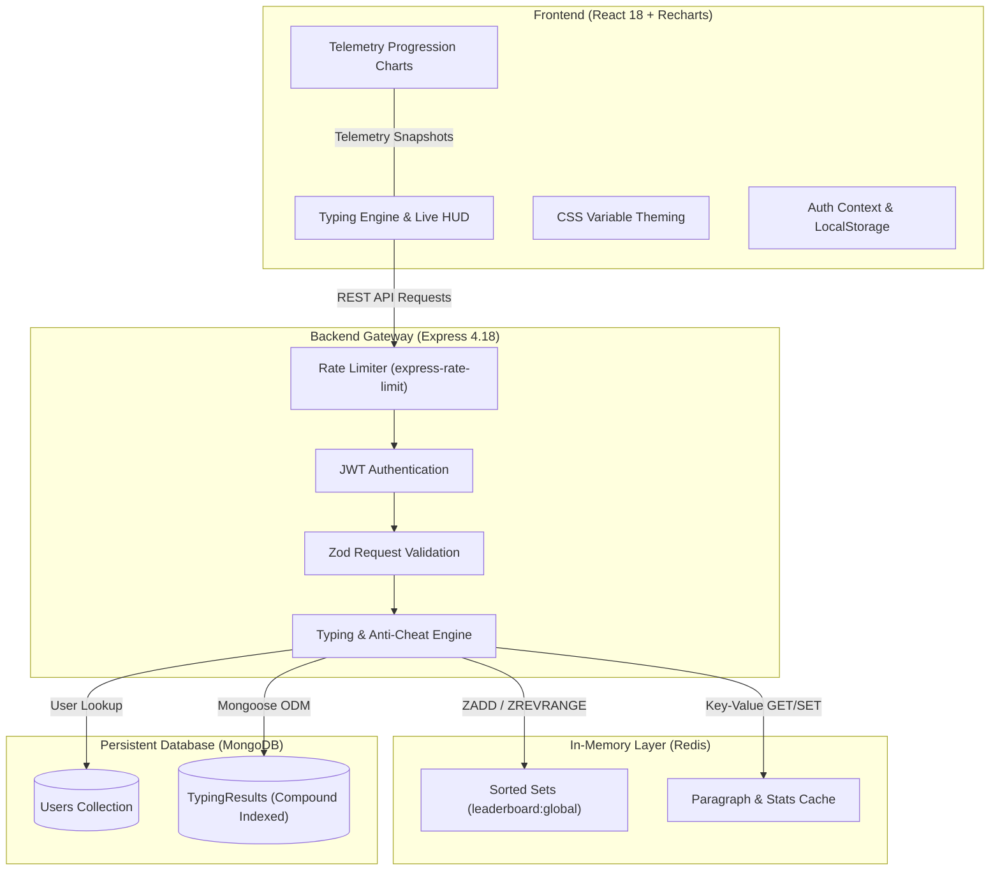

# ⚡ TypeBolt — Production-Grade Speed Typing Platform

[](https://github.com/invincible1786/typebolt/actions/workflows/ci.yml)
[-00ff88?style=flat&logo=jest)](https://github.com/invincible1786/typebolt)
[](https://nodejs.org)
[](https://expressjs.com)
[](https://react.dev)
[](https://redis.io)
[](https://www.mongodb.com)
[](LICENSE)

> **TypeBolt** is a high-performance, anti-cheat typing speed platform engineered with fullstack observability, Redis sorted-set leaderboards, interactive second-by-second keystroke telemetry, and standardized typing formulas.

---

### 🔗 Quick Links
- **[🚀 Launch Live Demo](https://typebolt.vercel.app)** *(Demo link)*
- **[📖 Comprehensive Architecture Docs](PROJECT_DOCUMENTATION.md)**
- **[📊 View API Documentation](#-rest-api-reference)**

---

## 🎯 What Makes TypeBolt Stand Out

Most typing speed apps blindly trust the client’s reported score or space-separated word counts. TypeBolt was built with production engineering standards:

1. **🛡️ Anti-Cheat Server-Side Recomputation**:
   - The client never dictates its own saved score.
   - The server recomputes Net WPM and Accuracy using the industry standard typing formula: `Math.round((typedCharacters / 5) / (timeTaken / 60))`.
   - Results submission is protected by dedicated rate limiters (`express-rate-limit`) to prevent script bots from poisoning leaderboard rankings.

2. **⚡ High-Throughput Redis Sorted Set Leaderboard**:
   - High-score updates leverage Redis Sorted Sets (`ZADD` / `ZREVRANGE`) with $O(\log N)$ rank insertions.
   - Resilient architectural fallback: if Redis goes offline or degrades, TypeBolt automatically falls back to MongoDB aggregation pipelines without service interruption.

3. **📈 Interactive Keystroke & Speed Telemetry (Recharts)**:
   - Second-by-second WPM and accuracy logging during live tests.
   - Post-test interactive dual-axis Area chart displaying speed progression and accuracy curve.

4. **✨ Craftsmanship & Micro-Interactions**:
   - **Smooth Blinking Caret**: Precision glowing caret cursor that tracks active keystrokes without layout shifts.
   - **Configurable Test Modes**: Instant toggling between 15s, 30s, 60s, and 120s test durations.
   - **Theme Engine**: Built-in visual theme switcher (⚡ Neon Dark & 🌐 Cyberpunk Slate).
   - **Post-Test Ergonomics**: Instant "Retry Same Text" and "New Paragraph" loops.
   - **Skeleton Shimmers & Friendly Empty States**: Zero layout shifts on initial load with engaging empty states.
   - **Field-by-Field Zod Validation**: Precise error feedback displayed directly under corresponding form inputs.

---

## 🏗️ System Architecture



---

## 🚀 Key Engineering Decisions & Trade-offs

| Engineering Challenge | Naive Approach | TypeBolt Solution |
| :--- | :--- | :--- |
| **WPM Computation** | Splitting text by spaces (`text.split(' ')`). Short words inflate WPM, punctuation breaks count. | Standardized formula: `(typedCharacters / 5) / minutes`. Client HUD and server validation are 100% unified. |
| **Leaderboard Performance** | Full table scans or MongoDB aggregations on every user request ($O(N \log N)$). | Redis Sorted Sets (`ZADD` / `ZREVRANGE`) yielding $O(\log N)$ score ingestion and sub-millisecond leaderboard retrieval, backed by Mongo aggregation fallback. |
| **Paragraph Latency** | Querying third-party APIs on every test (e.g. expired SSL certificates causing 2-second timeout hangs). | Zero-latency curated paragraph bank with in-memory Redis caching, eliminating external failure points during demos. |
| **Database Schema Hygiene** | Using Mongoose reserved keyword `errors` which throws runtime warnings. | Cleanly migrated to `errorCount` with backwards-compatible Mongoose virtuals and compound indexing on `{ wpm: -1, timestamp: -1 }`. |
| **Anti-Cheat Security** | Client sends calculated WPM directly to backend to store in DB. | Client sends raw keystroke count and elapsed time; server recomputes WPM & accuracy, logs mismatches, and rate-limits submissions. |

---

## 📡 REST API Reference

### Authentication
- `POST /api/auth/register` — Create account (`username`, `email`, `password`)
- `POST /api/auth/login` — Authenticate and receive JWT token

### Typing & Telemetry
- `GET /api/paragraph` — Fetch a randomized, curated paragraph challenge (cached, zero-latency)
- `POST /api/typing-result` — Submit test results with anti-cheat recomputation (*Rate-limited*)
- `GET /api/typing-history?page=1&limit=8` — Paginated test history for authenticated user
- `GET /api/user-stats` — Aggregated stats (total tests, best WPM, avg accuracy, avg WPM)
- `GET /api/leaderboard?limit=10` — Global top typist leaderboard (Redis sorted set / Mongo fallback)

---

## 🧪 Comprehensive Test Suite

TypeBolt includes **35 unit and integration tests** across both backend and frontend:

```bash
# Run backend test suite (23 Jest tests: Auth, Anti-Cheat, Leaderboard, Mongoose)
npm test --prefix backend

# Run frontend test suite (12 React Testing Library tests: Engine, Telemetry, Utils)
npm test --prefix frontend -- --watchAll=false
```

---

## 🛠️ Quickstart Local Setup

### Prerequisites
- [Node.js](https://nodejs.org) (v18 or higher)
- [MongoDB](https://www.mongodb.com/) (Local or MongoDB Atlas)
- [Redis](https://redis.io/) (Local or Docker)

### 1. Clone & Install
```bash
git clone https://github.com/invincible1786/typebolt.git
cd typebolt
```

### 2. Backend Configuration
Create `backend/.env`:
```env
PORT=5000
NODE_ENV=development
MONGO_URI=mongodb://localhost:27017/typebolt
REDIS_URL=redis://localhost:6379
JWT_SECRET=your_super_secret_jwt_key_at_least_32_characters
```

Run backend:
```bash
cd backend
npm install
npm run dev
```

### 3. Frontend Configuration
```bash
cd ../frontend
npm install
npm start
```
Open [http://localhost:3000](http://localhost:3000) in your browser.

---

## 💡 Why I Built This

I built TypeBolt to explore the intersection of **low-latency state management**, **anti-cheat data validation**, and **craft-focused frontend micro-interactions**. Typing tests look simple from a distance, but building one properly exposes core fullstack challenges:
- How to keep server-side validation strictly aligned with client telemetry.
- How to maintain sub-millisecond leaderboard queries at scale using in-memory sorted sets.
- How to structure resilient caching layers that degrade gracefully when external microservices or cache clusters go offline.

### What I'd Improve Next
- **Multiplayer Real-time Race Mode**: WebSockets (Socket.io) room matchmaking to race live against other typists.
- **Code Snippet Mode**: Syntax-highlighted programming language snippets (JavaScript, Python, Rust, Go).
- **Refresh Token Rotation**: Short-lived access tokens (15m) + secure HTTP-only refresh tokens stored in Redis.

---

## 📄 License
Distributed under the **MIT License**. See `LICENSE` for more information.
